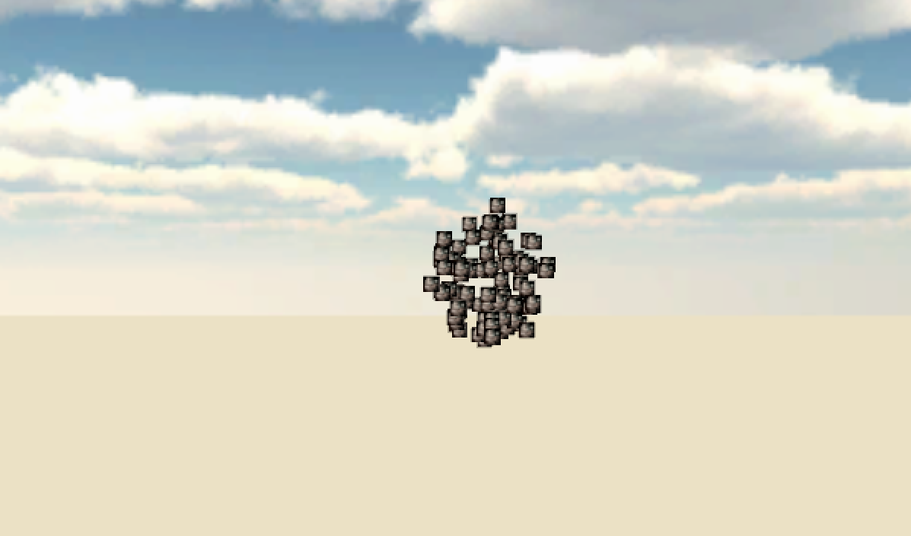
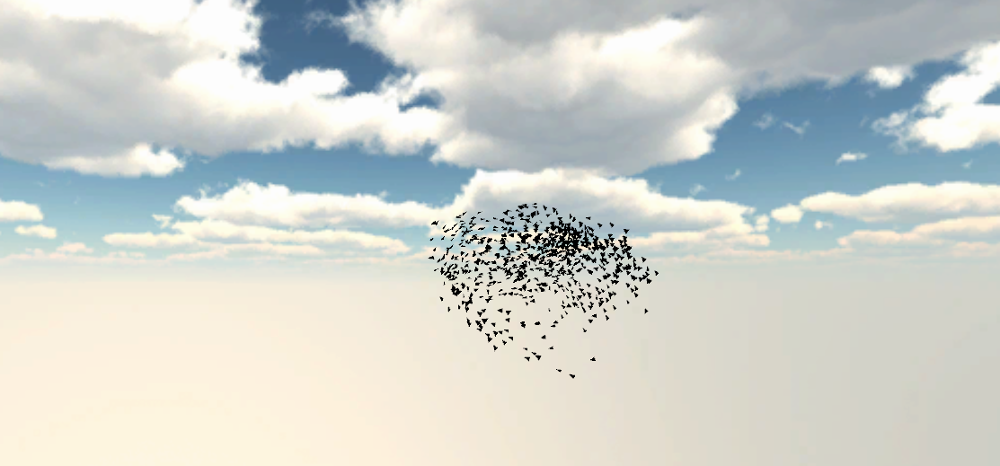

# DD1354 Project: Simulating a Flock of Starlings

## What is this project?

This is a project in the course DD1354 Models and Simulations. The purpose behind this project is to implement boid models and compare them to real-world data.

## Updates

## 2026-03-11

Whoops! I forgot to push this blog update when I intended. After a week of exams and deadlines mistakes happen, but oh well!

Starting of the project, I set up this blog using `jekyll` with GitHub Pages and I initialized a Unity project (Version 2022.3.62f3). The very basic goal was to get some working simulation, similar to LAB 1 in this course but for birds! Once I have something rudimentary working, I'll focus on making it accurate.

By gradually figuring out how the Unity `GameObject` functions and how to work with `Prefabs`, I eventually get a working simulation similar to that of LAB 1- but with my own code! That said, a bunch of the functions and some assets were taken from other labs; but the core of the project is not in creating everything on my own, but rather learning the methods of a paper and applying it to simulations within the scope of this course.

Whilst the graphis won't improve much past this (I might find some nicer models) there will be some better simulations coming up; next task will be to implement the data collection methods of Ballerini et al. paper!

## 2026-03-12

Apart from pushing up yesterdays update, I have worked on understanding the math behind the paper I use as a basis for my project (Empirical investigation of starling flocks: a benchmark study in collective animal behaviour) and implementing said math in order to do actual comparisons!

A lot of the math is fairly advanced to implement with an effective algorithm, but I'll try to implement it on my own (Complex Hull, Minimum Boundry Box). Conceptually, it is fairly simple; especially he boundry boxes, but it is complicated by Unity not doing it in the "correct" way by default.

## 2026-03-14

In spite of my best efforts, I have had to throw in the towel on implementing the algorithms on my own; quite simply not enough time left! Some more positive notes, I have gotten the simulation working properly with some graphics that look a bit better than the first version:

Rather than spend more time to maybe get my simulations to run better (even if it does run decently) I will be spending more time on the report to compensate.

